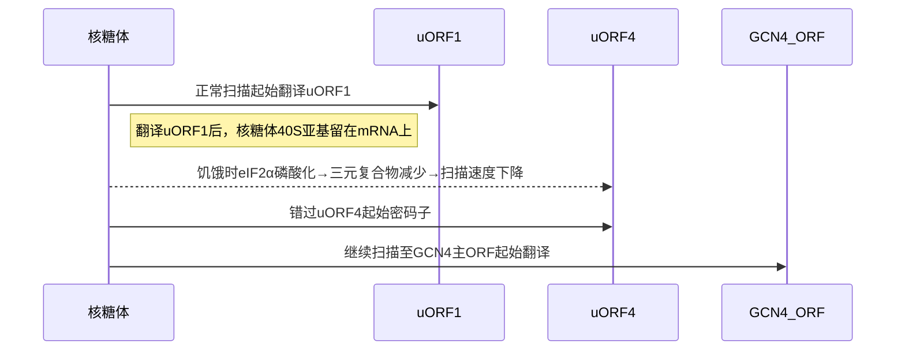

Gcn4 蛋白是**酵母（酿酒酵母）中调控氨基酸合成通路的核心转录因子**，也是研究真核生物翻译水平基因调控的经典模型。其独特之处在于：在氨基酸饥饿时，通过**上游开放阅读框（uORFs）介导的翻译重编程机制**，实现自身蛋白合成的特异性激活，进而启动数百个靶基因的转录。以下从多角度详细解析：

---

### **一、基本特性**

| **属性**   | **描述**                                                                            |
| -------- | --------------------------------------------------------------------------------- |
| **基因定位** | 酵母染色体 *GCN4* 基因（长约 281 个氨基酸）                                                      |
| **蛋白结构** | 碱性亮氨酸拉链（bZIP）结构域：  - **N 端碱性区**：结合 DNA（5'-ATGACTCAT-3'）  - **C 端亮氨酸拉链**：二聚化 |
| **功能**   | 转录激活氨基酸合成相关基因（如 *HIS3*, *ARG1*, *TRP3* 等）                                         |
| **调控层级** | **翻译水平调控**（核心特色）→ 转录激活                                                            |

---

### **二、关键调控机制：uORF 介导的翻译重编程**
**背景**：  
- *GCN4* mRNA 的 5'UTR 含有**4 个保守的上游开放阅读框（uORF1-4）**。  
- 正常情况下（氨基酸充足），核糖体从 5'帽开始扫描，优先翻译 uORF1，随后在 uORF4 终止，**抑制主 ORF（Gcn4 蛋白）翻译**。  

**氨基酸饥饿时的激活机制**：  

1. **eIF2α磷酸化触发**：  
   - 氨基酸缺乏激活激酶**Gcn2**，磷酸化翻译起始因子 eIF2α（真核翻译起始因子 2 的α亚基）。  
   - 磷酸化 eIF2α抑制 eIF2B（鸟苷酸交换因子），**降低 eIF2-GTP-Met-tRNAMeti三元复合物**丰度。  
1. **uORF 翻译动力学改变**：  
   - 核糖体翻译 uORF1 后，40S 亚基继续扫描（60S 亚基解离）。  
   - **三元复合物减少**导致核糖体扫描速度减慢，**错过 uORF2-4 的起始密码子**（因无足够起始复合物）。  
1. **主 ORF 翻译激活**：  
   - 扫描减速的 40S 亚基最终到达 Gcn4 主 ORF 起始密码子（AUG），重新组装完整核糖体，**启动 Gcn4 蛋白合成**。  

> **核心逻辑**：uORF4 是强翻译起始位点，正常条件下会"捕获"核糖体；饥饿时核糖体因扫描延迟"跳过"uORF4，实现主 ORF 的**翻译逃逸**。

---

### **三、 Gcn4 的转录调控网络**
Gcn4 作为转录因子，通过结合靶基因启动子中的**Gcn4 响应元件（GCRE, 5'-ATGACTCAT-3'）** 激活表达：  

| **靶基因类别**       | **代表基因**       | **功能**                     |
|----------------------|--------------------|------------------------------|
| **氨基酸合成**       | *HIS4*, *LEU2*     | 组氨酸、亮氨酸生物合成       |
| **氨基酸转运**       | *GAP1*             | 通用氨基酸渗透酶             |
| **维生素合成**       | *THI4*             | 硫胺素合成                  |
| **应激响应因子**     | *YAP1*             | 氧化应激应答                |

---

### **四、实验证据与关键发现**
1. **uORF 功能验证**：  
   - 删除 uORF1-4 → Gcn4 组成性高表达（不受饥饿调控）。  
   - 突变 uORF1 起始密码子 → 丧失饥饿诱导能力。  
1. **eIF2α磷酸化的必要性**：  
   - *GCN2* 基因敲除 → 氨基酸饥饿时无法诱导 Gcn4。  
   - 表达不可磷酸化的 eIF2α突变体（S51A）→ 阻断 Gcn4 激活。  
1. **核糖体足迹图谱**：  
   - 核糖体分析（Ribo-seq）显示：饥饿时 uORF4 翻译减少，主 ORF 翻译增加。  

---

### **五、高等真核生物中的同源物**
Gcn4 在哺乳动物中的功能同源物是**ATF4**（Activating Transcription Factor 4），通过相似的 uORF 机制响应应激：  

| **应激类型**         | **激酶**      | **eIF2α磷酸化** | **生理意义**               |
|----------------------|---------------|------------------|----------------------------|
| **氨基酸饥饿**       | GCN2          | 是               | 激活 ATF4，启动氨基酸响应   |
| **内质网应激**       | PERK          | 是               | 未折叠蛋白反应（UPR）      |
| **氧化应激**         | HRI           | 是               | 血红素调控                 |
| **病毒感染**         | PKR           | 是               | 抗病毒反应                 |

- **ATF4 的 uORF 结构**：含 2 个保守 uORF（uORF1 为正向调控，uORF2 为抑制元件），通过类似扫描逃逸机制激活翻译。  

---

### **六、生物学意义与研究价值**
1. **基础科学贡献**：  
   - 首个揭示**翻译水平基因特异性调控**的真核模型。  
   - 阐明 uORF 作为**翻译调控开关**的通用原理（>50%人类 mRNA 含 uORF）。  
1. **应用价值**：  
   - 解析癌症、神经退行性疾病中应激通路失调机制（如 ATF4 在肿瘤耐药中的作用）。  
   - 指导合成生物学设计（人工 uORF 系统调控治疗蛋白表达）。  

---

### **总结：Gcn4 调控的核心通路**

Gcn4 不仅是酵母氨基酸稳态的守卫者，更是真核生物**翻译调控领域的里程碑**，其机制深刻影响了从基础生物学到疾病治疗的广泛研究。