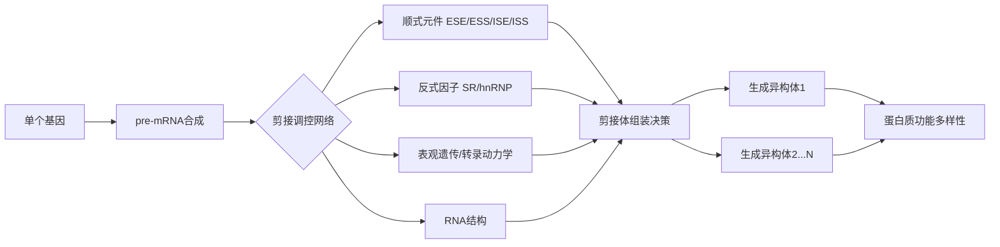

可变剪接（Alternative Splicing）是真核生物基因表达调控的核心机制，允许单个基因通过不同组合的外显子产生多种蛋白质异构体（Isoforms），显著增加蛋白质组的多样性和功能复杂性。以下是其系统总结：

---

### **一、基本概念与生物学意义**

| **项目**         | **说明**                                                                 |
|------------------|--------------------------------------------------------------------------|
| **定义**         | 前体 mRNA（pre-mRNA）通过不同剪接位点选择，生成不同成熟 mRNA 的过程。        |
| **发生位置**     | 细胞核内（剪接体介导），少数由自剪接内含子完成。                          |
| **进化意义**     | 使真核生物（尤其高等动物）用有限基因（人类约 2 万）编码更多蛋白质（>10 万）。 |
| **功能影响**     | 产生结构/功能不同的蛋白质、调控 mRNA 稳定性、翻译效率或亚细胞定位。         |

---

### **二、主要可变剪接类型**

| **类型**               | **机制**                                                                 | **实例**                                  |
|------------------------|--------------------------------------------------------------------------|-------------------------------------------|
| **1. 外显子跳跃 (Exon Skipping)** | 特定外显子被完全跳过不包含在成熟 mRNA 中。                               | 人类肌营养不良蛋白基因（DMD）             |
| **2. 互斥外显子 (Mutually Exclusive Exons)** | 两个相邻外显子中仅一个被保留。                                       | 果蝇 Dscam 基因（>38,000 种异构体）          |
| **3. 可变 5'剪接位点 (Alternative 5' Splice Site)** | 同一外显子使用不同 5'剪接位点，改变外显子长度。                      | 小鼠 FGFR2 基因（调控细胞增殖）             |
| **4. 可变 3'剪接位点 (Alternative 3' Splice Site)** | 同一外显子使用不同 3'剪接位点，改变外显子长度。                      | 人类 BRCA1 基因（乳腺癌相关）               |
| **5. 内含子保留 (Intron Retention)** | 内含子不被切除而保留在成熟 mRNA 中（常见于植物、真菌，动物较少）。     | 拟南芥开花基因 FLC                          |
| **6. 可变启动子/多聚腺苷酸化 (Alternative Promoter/PolyA)** | 与转录起始或终止偶联，影响首尾外显子选择。                          | 人类 T 细胞 CD45 基因（免疫调控）             |

> **注**：>90%人类基因发生可变剪接，平均每个基因产生 6-7 种异构体。

---

### **三、分子执行机制：剪接体动态组装**
可变剪接由**剪接体（Spliceosome）**（核糖核蛋白复合体）完成，其核心组分：

| **复合体**       | **组成**                                | **功能**                                  |
|------------------|-----------------------------------------|------------------------------------------|
| **主要 snRNPs**   | U1、U2、U4/U6、U5（小核核糖核蛋白）      | 识别剪接位点，催化转酯反应                |
| **辅助因子**     | SR 蛋白、hnRNP 蛋白、RBM 家族蛋白           | 结合调控元件，促进/抑制剪接位点选择       |
| **剪接位点信号** | 5'剪接位点（5'SS）：`GU` 3'剪接位点（3'SS）：`AG` 分支点（BPS）：`YNCURAY`（Y=嘧啶，R=嘌呤） | 提供剪接反应底物                          |

**剪接体组装步骤**：
1. **U1 snRNP** 结合 5'SS → **SF1/BBP** 结合 BPS → **U2 snRNP** 取代 SF1 结合 BPS。
2. **U4/U6-U5 tri-snRNP** 加入形成完整剪接体 → **U1/U4 释放** → 活性中心形成。
3. **两次转酯反应**：  
   - 第一次：BPS 腺苷酸 2'-OH 攻击 5'SS 的磷酸二酯键，形成套索结构（Lariat）。  
   - 第二次：新 5'外显子的 3'-OH 攻击 3'SS，连接相邻外显子，释放内含子套索。

---

### **四、调控机制：顺式元件与反式因子**
#### **1. 顺式作用元件（cis-elements）**
| **元件类型**       | **位置**            | **序列特征**                     | **功能**                          |
|--------------------|---------------------|----------------------------------|-----------------------------------|
| **外显子剪接增强子 (ESE)** | 外显子内            | 富含 GA/AG                       | 招募 SR 蛋白，促进剪接              |
| **外显子剪接沉默子 (ESS)** | 外显子内            | 富含 U/UCU                       | 招募 hnRNP，抑制剪接               |
| **内含子剪接增强子 (ISE)** | 内含子内            | 可变                             | 增强剪接效率                      |
| **内含子剪接沉默子 (ISS)** | 内含子内            | 可变                             | 抑制剪接位点使用                  |

#### **2. 反式作用因子（trans-factors）**
| **因子类型**     | **代表蛋白**        | **作用机制**                                  |
|------------------|---------------------|---------------------------------------------|
| **激活因子**     | SR 蛋白家族（SRSF1-12） | 结合 ESE，招募 U1/U2 snRNP，促进剪接位点识别    |
| **抑制因子**     | hnRNP 家族（hnRNP A1, I） | 结合 ESS/ISS，遮蔽剪接位点或竞争 SR 蛋白结合     |
| **组织特异性因子** | NOVA1（神经元） RBFOX（肌肉/脑） | 时空特异性表达，调控特定组织剪接模式          |

---

### **五、调控层级与动态性**
1. **表观遗传调控**：  
   - 组蛋白修饰（如 H3K36me3）招募剪接因子 PTBP1，促进外显子跳跃。  
1. **转录动力学**：  
   - RNA 聚合酶 II（Pol II）延伸速率影响剪接：慢速延伸促进包含弱剪接位点的外显子。  
1. **RNA 二级结构**：  
   - 茎环结构遮蔽剪接位点或调控元件（如 FMR1 基因 5'UTR 影响剪接）。  
1. **反馈调控环路**：  
   - PTBP1 抑制自身 pre-mRNA 剪接，维持稳态水平。  

---

### **六、研究方法与技术**

| **方法**                | **原理**                                  | **应用**                                  |
|-------------------------|------------------------------------------|------------------------------------------|
| **RNA-Seq**             | 高通量测序+生物信息学分析（如 rMATS, MAJIQ） | 全转录组剪接图谱绘制                     |
| **Minigene 报告系统**    | 构建含目标外显子的重组质粒转染细胞        | 验证顺式元件功能                         |
| **CLIP-seq**            | 紫外交联免疫沉淀+测序（如 HITS-CLIP）       | 定位 RNA 结合蛋白（RBPs）结合位点           |
| **CRISPR 筛选**          | 靶向敲除剪接因子基因                      | 鉴定调控特定剪接事件的关键因子            |
| **ASO（反义寡核苷酸）** | 设计互补 RNA 阻断剪接位点                   | 治疗剪接相关疾病（如脊髓性肌萎缩症 SMA）   |

---

### **七、与疾病关联**

| **疾病类型**    | **基因/剪接事件**                    | **病理机制**     |
| ----------- | ------------------------------ | ------------ |
| **癌症**      | BRCA1（外显子跳跃）→ 截短蛋白             | DNA 修复缺陷     |
|             | CD44（可变外显子组合）→ 促转移异构体          | 增强癌细胞侵袭      |
| **神经退行性疾病** | Tau 蛋白（外显子 10 保留）→ 4R-tau 过度积累 | 阿尔茨海默病神经纤维缠结 |
|             | SMN2（外显子 7 跳跃）→ 功能缺失           | 脊髓性肌萎缩症（SMA） |
| **代谢疾病**    | INS（胰岛素受体可变剪接）                 | 胰岛素抵抗        |

> **治疗策略**：  
> - **ASO 疗法**：诺西那生钠（Nusinersen）纠正 SMN2 外显子 7 跳跃，治疗 SMA。  
> - **小分子剪接调节剂**：Risdiplam（SMN2 剪接修饰剂）。  

---

### **八、进化保守性与特殊类型**
1. **跨物种保守性**：  
   - 核心剪接机制从酵母到人类保守，但可变剪接复杂性随进化增加（人类>果蝇>线虫）。  
2. **非典型剪接**：  
   - **反式剪接（trans-splicing）**：两个独立 pre-mRNA 分子连接（锥虫、线虫常见）。  
   - **选择性剪接与翻译偶联**：无义介导的 mRNA 降解（NMD）清除含提前终止密码子的异构体。  

---

### **总结：可变剪接的核心框架**

