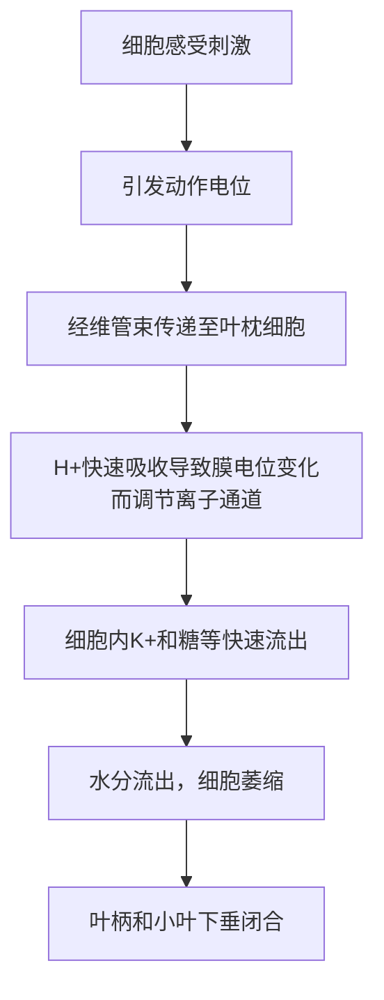

## 向性运动
### 向光性
向光性是植物感受光信号刺激引起的**弯曲生长**。地上部分有向光性，而**根**有一定负向光性

对于胚芽鞘，胚芽鞘尖端产生的生长信号为**生长素**，可见[[生长素的发现]]。而在此过程中感受光的物质是**向光素**，一种蛋白激酶。向光素在吸收蓝光后自磷酸化，从质膜上分离后进入胞质，诱发向光性反应

![[image-81.png|349x279]]

### 向重力性
向重力性是植物感受重力的刺激，在重力方向上发生生长反应的现象。根具有正向重力性，茎具有**负**向重力性

感受重力的敏感部位是**根冠**。这与根冠细胞内的**淀粉体**有关。淀粉体会在重力的作用下**沉积**根冠细胞中的一侧，进而感受重力

有趣的是，显然虽然根冠可以感受重力，但发生**弯曲**的部分是根的伸长区。这与 [[极性运输模型-化学渗透假说#生长素的流出|PIN]] 在淀粉体的信号下**重定位**，导致近轴端的 IAA 浓度增加，生长受到**抑致**，进而发生弯曲

$\ce{Ca^2+}$ 和 $\ce{IP3}$ 和细胞骨架也参与根的向重力性反应  
### 向触性
向触性指植物对接触的生长反应，由单方向机械刺激引起的回旋生长运动。典型的例子有**葫芦科植物卷须的运动**（丝瓜，南瓜等）

这一类向性运动可能由膜电位引发的膨压变化有关，也可能与 IAA 的不均匀分布有关

---

## 感性运动
**感**性运动也是由特定信号引起的运动，但与**向**性运动不同的是，感性运动的运动方向**与刺激的方向无关**

按刺激性质可分为
- 感震性
- 感夜性
- 感温性

### 感震性
**感震性**指植物对机械振动的感受，典型例子就是**含羞草**，通过电位变化产生的**膨压**变化而实现快速反应的运动

### 感夜性
感夜性指植物接受光暗变化信号，引起叶片的开合运动

如大豆、花生、四季豆、合欢等豆科植物的叶片，白天呈水平展开，夜间合拢或下垂

这也是一种植物对光的反应，通路和[[钾离子-苹果酸渗透调节说.canvas|钾离子-苹果酸渗透调节说]]即**气孔运动**的机制基本一致

### 感温性
**感温性**指由温度变化引起器官两侧不均匀生长的运动，例如白天开，晚上合的**郁金香**

---
## 生物钟
生物钟指植物的**内源性节奏周期**。注意这不是准确的 24 hrs，而是在 20-28 hrs 间

生物钟由三部分组成
1. input
2. 中央振荡器
3. output

总之相当复杂